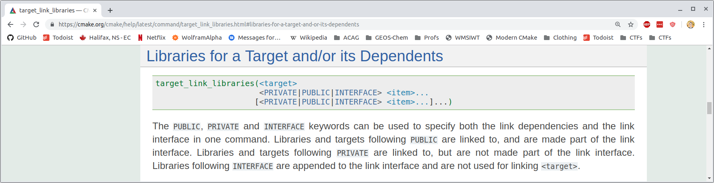

## Targets and properties

(this is important) 


<div style="text-align: left">

### Targets
---

- A target is a component of your project (i.e. a library or executable)
- Targets are created with
    ```cmake
    add_library(<target name> [STATIC | SHARED | MODULE]
        [EXCLUDE_FROM_ALL]
        [source1] [source2 ...]
    )
    ```
    and
    ```cmake
    add_executable(<target name> [EXCLUDE_FROM_ALL]
        [source1] [source2 ...]
    )
    ```
- And every target has properties
</div>


<div style="text-align: left">

### Properties
---

- Target properties are defined in one of two scopes: `PRIVATE` or `INTERFACE`
- A target's properties serve two purposes:
    1. Private properties control how the target is built
    2. Interface properties pass requirements to dependent targets

<div style="text-align: center; font-size: 0.6em; margin: 20px auto;">

| Scope | Used internally? | Passed to dependents? |
|---|:---:|:---:|
| `PRIVATE` | <span style="color: green;">Yes</span> | <span style="color: red;">No</span> |
| `INTERFACE` | <span style="color: red;">No</span> | <span style="color: green;">Yes</span> |
| `PUBLIC` | <span style="color: green;">Yes</span> | <span style="color: green;">Yes</span> |

</div>
</div>


<div style="text-align: left">

### Setting common target properties
---
<div style="margin: 0; font-size: 0.7em;">

- Compiler definitions are added with

```cmake
target_compile_definitions(<target>
                        <INTERFACE|PUBLIC|PRIVATE> [items1...]
                        [<INTERFACE|PUBLIC|PRIVATE> [items2...] ...])
```
- Compiler options (flags) are added with

```cmake
target_compile_options(<target> [BEFORE]
                    <INTERFACE|PUBLIC|PRIVATE> [items1...]
                    [<INTERFACE|PUBLIC|PRIVATE> [items2...] ...])
```
- Include directories are added with

```cmake
target_include_directories(<target> [SYSTEM] [BEFORE]
                        <INTERFACE|PUBLIC|PRIVATE> [items1...]
                        [<INTERFACE|PUBLIC|PRIVATE> [items2...] ...])
```

- Link libraries are added with 

```cmake
target_link_libraries(<target>
                    <PRIVATE|PUBLIC|INTERFACE> <item>...
                    [<PRIVATE|PUBLIC|INTERFACE> <item>...]...)
```
</div>
</div>


<div style="text-align: left">

### How interface properties are passed
---
- A target "inherits" interface properties from the targets it "links"


- So 
    ```cmake
    target_link_libraries(targetB PUBLIC targetA)
    ```
    causes `targetB` to "inherit" `targetA`'s interface properties
</div>

<div style="text-align: left">


### Modern CMake
---
- Modern CMake is all about targets and properties
- A target's interface properties should fully qualify its dependencies
- This means fully resolved dependencies are passed up the chain such as
    - Include directories
    - Link libraries
    - Required compiler flags
- This makes it easy to maintain projects with deep hierarchical structure (e.g. GCHP)
- Leads to a fundamental differences from GNUMake:

<div style="text-align: center; font-size: 0.6em; margin: 20px auto;">

| | Approach | Operation | 
|---|:---:|---|
| CMakeLists.txt | Bottom-up | Description of a project's targets | 
| GNUMakefile | Top-down | Scripting of a project's build |

</div>
</div>